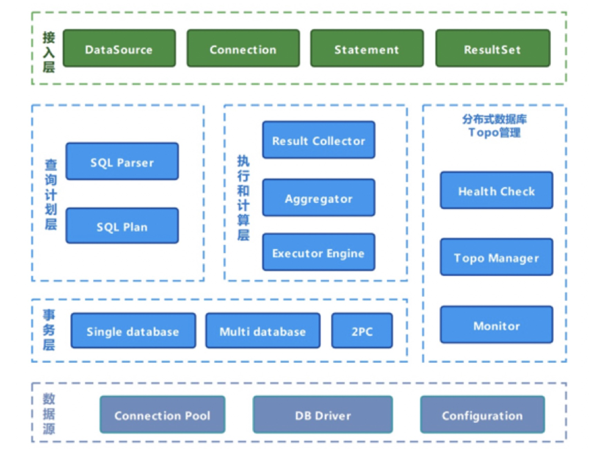

# VtDriver

[English Docs](./docs/readme.en.md)

VtDriver是一套基于分布式数据库Vitess而开发的Vitess
Java客户端解决方案，在Java的JDBC层实现了Vitess关于分库、健康检查、灵活水平拆分和主从切换等额外服务。VtDriver通过jar包的形式提供服务，帮助应用程序直连数据库而非使用中间代理（VTGate）节点。因为完全基于标准的JDBC接口来实现的，VtDriver可以理解为Vitess的JDBC驱动，兼容JDBC、大部分主流数据库链接池和ORM框架。

## Content Table

* [Why VtDriver](#why_vtdriver)
* [Architecture](#architecture)
* [Quick Start](#quick_start)
* [Features/Configuration](#features)
* [Road Map](#road_map)
* [Acknowledgements](#acknowledgements)

## 
Why VtDriver

VtDriver是对Vitess生态的一种解决方案补充，旨在缩短数据访问链路、提高性能和节约资源，从而达到节能增效的目的，适用于Java开发的对性能有极高要求的OLTP应用和对资源消耗有极其严苛限制的场景，以下图为例：

如图左所示，作为一款分布式数据库，Vitess开发了一些中间代理模块来解决异构语言、集群管理/保护、数据同步和适配多数据引擎等问题。这样的设计能够为数据库带来高可用、灵活性和扩展性。但出于提升数据库性能，降低访问时延和节约资源的考虑，VtDriver在最消耗资源的sql请求和数据返回的链路上做出了改变，如上图所示。

相比于Vitess，一个数据请求（DML）从应用端发出到接收，需要经过 app->VTGate->VTTablet->database->VTTablet->VTGate->
app的路径，VtDriver通过jar包的形式将VTGate的能力（分布式SQL改写、结果收集处理、健康检查/切换）赋能给了各应用程序节点，使得应用程序能够直接访问数据库app ->database
（图右所示），从而减少了网络上的开销。并且，因为降低了对于中间节点的依赖，可以不再像原来一样需要投入大量资源来维护中间节点的稳定性，对于那些非常在意CPU资源消耗的使用者来说，更加合适。

需要注意的是，VtDriver是Vitess生态的补充方案而非替代方案，VtDriver仍然需要与VTTablet，Topo元数据等进行交互，来完成健康检查、故障自动切换和横向扩缩容等功能。因此在部署上仍然需要先搭建一套完整的Vitess架构。此外，因为跳过了VTTablet直连数据库，在某些情况下也会造成数据库链接消耗过大的情况，这也需要使用者在使用时注意。以下是使用Vitess传统链接方式VTGate和VtDriver方式所带来的一些特点的比较：

|            | **Vitess-VTGate** | **Vitess-VtDriver** |
| ---------- | ----------------- | --------------- |
| 链接数消耗 | 低                | 高              |
| 异构语言   | 任意              | 仅Java          |
| 性能       | 损耗略高          | 损耗低          |
| 客户端入口 | 有                | 无              |

## 
Architecture

如图所示，是VtDriver的设计架构，主要分为接口API模块，查询计划生成的Plan模块，负责执行和计算的Engine模块，负责事务的TX模块，数据库底层连接的Datasource模块和分布式数据库管理的Topo模块：

* __API__：实现了JDBC标准接口模块，Java用户只需要替换驱动，代码不需要做任何修改便可使用VtDriver
* __Plan__：基于SQL请求和数据库Topo元数据生成相应的执行计划
* **Engine**：负责执行Plan生成的执行计划，并收集和计算各个分片返回的结果
* **TX**：负责单库时候和多库执行时候的事务管理， 严格的两阶段提交功能目前还在开发当中
* **Datasource**：负责与各个分片集群的真实数据库的连接，包括了连接池管理，驱动管理（目前仅支持MySQL）和配置管理
* **Topo Management**
  ：负责读取和管理分布式数据库的Topo信息和元数据，包括了Tablet信息和状态、数据库表信息和分表Index，实时健康检查，并负责在监测到Tablet异常、主从切换或resharding完成的时候执行响应操作

## 
Quick Start

* 可参考[VtDriver环境搭建](./docs/QuickStart.md)

## 
Features/Configuration

因为是基于Vitess开发出来的Java 驱动客户端，因此VtDriver在很多方面保持了跟Vitess一样的特性，比如分片执行计划/引擎、事物管理、topo和健康管理等。不过因为VtDriver是以Java
JDBC驱动为目的开发的，导致其在某些方面的设计与以数据库服务器为特性开发的Vitess VTGate有些许不同，并且大部分配置信息通过url进行配置。另外，基于业务等需求等原因，我们也在Vitess上面加了些许新的功能。

### Split Table：

分表是VtDriver开发的一个新功能点，基于现有的分片执行计划/引擎基础开发而来，主要针对单表数据量过大而影响性能的问题。具体可查看[VtDriver分表](./docs/splitTable.md)

### Read-Write Splitting：

不同于Vitess读写分离，VtDriver通过在datasource的Url中配置role=rr/rw来确定读写分离，默认为读主。

### Consolidation：

Query
Consolidation是Vitess在VTTablet层开发的一个用以保护数据库不受某个特定慢查询反复同时执行拖累而过载的一个功能，VtDriver将其移植到了驱动层。其原理是当一个SQL请求发给VtDriver，VtDriver监测到其一样的一个SQL请求还在执行当中时，会将当前SQL请求暂存，等到其前一个SQL请求的返回结果，并将其返回结果同时也当作当前SQL的返回结果返回。

与读写分离一样，该功能同样需要其在datasource的Url中配置queryConsolidator=true。

### Specified Shard Destination

VtDriver/Vitess通过解析SQL语句中的分片键与值来判断SQL需要被发往哪个分片的。但是有些时候，分片条件并不存在于SQL，而存在于外部业务逻辑。因此，VtDriver允许使用者通过发送sql带注释的方式，在执行计划前解析注释中set_shard指令来确定是否需要指定分片执行，例如：/\*shard=-80\*/
select \* from table。

需要注意的是，出于水平扩展的考虑，指定分片只支持update\delete\select，不支持insert。另外，如果数据库进行了水平拆分，需要修改指定shard范围，否则会报错。

### VtDriver支持配置的参数

* [VtDriver支持配置的参数](./docs/properties.md)

## 
Road Map

### Database

* Vitess based on MySQL （其他数据库产品，直连MySQL暂不支持）

### VIndex

* 仅支持murmurHash Vitess的分片算法目前暂未实现

### DML/DDL

* Select/Insert/Update/Delete
* 部分SET语句
* SHOW语句暂不支持
* DDL语句暂不支持

### SQL

* AGGREGATION
* DISTINCT
* HAVING
* ORDER BY
* GROUP BY
* JOIN
* UNION / UNION ALL
* SUBQUERY / PULLOUT SUBQUERY

详细内容请参考 [VtDriver支持的SQL](./docs/VtDriver支持的SQL.md)。

### Query Method

* Simple Query
* Stream Query
* MultiQuery (JOIN/UNION/PULLOUT SUBQUERY不支持)

### Auto Increment Key

* Sequence （暂不支持）

### Distributed Transactions

* best-effort distributed transactions
* 暂不支持2PC (two-phase commit)

## 
Acknowledgements

VtDriver在开发中借鉴了许多开源的程序、框架的方法和意见，在此做出感谢，是他们让我们站在了巨人的肩膀上去眺望世界：

* [Vitess](https://vitess.io/)
* [Druid](https://github.com/alibaba/druid)
* [mysql-connector](https://github.com/mysql/mysql-connector-j)
* [prometheus](https://prometheus.io/)
* [HikariCp](https://github.com/brettwooldridge/HikariCP)
* [ShardingSphsere](https://shardingsphere.apache.org/)

Note: 以上特别感谢Vitess，Vitess给我们节省大量研发成本，感谢[PlanetScale CTO Sugu Sougoumarane](https://github.com/sougou) 对我们团队的支持。

